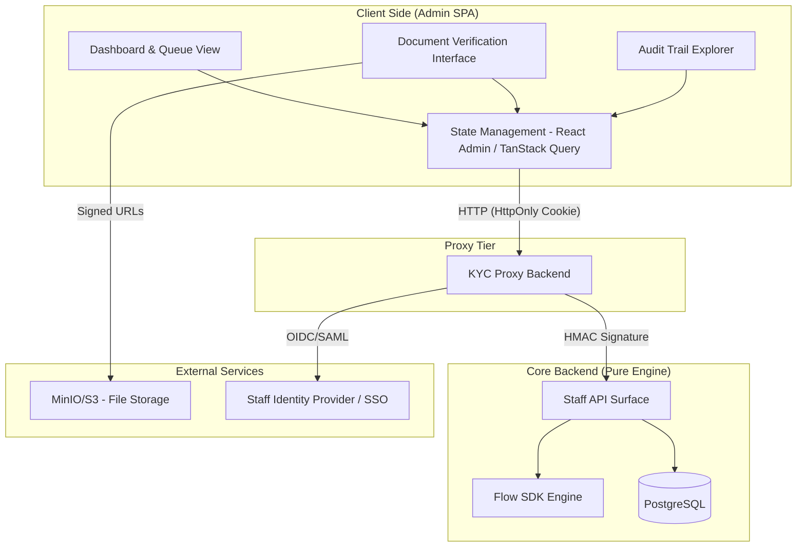
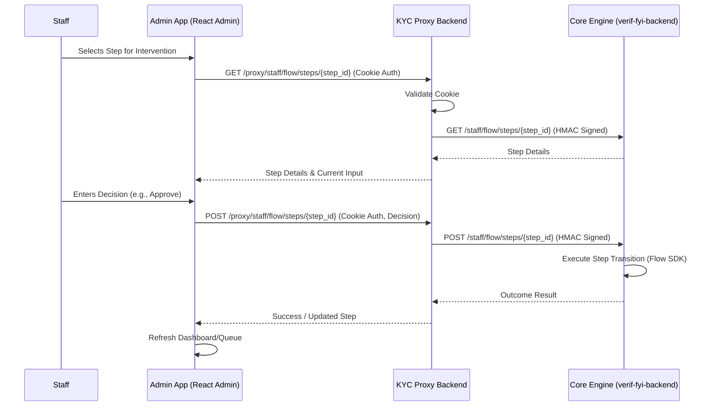

# KYC Manager Admin App Architecture

## Why?

The KYC Manager Admin App is an internal tool designed for staff to oversee, monitor, and intervene in the KYC process. It requires high density of information, powerful filtering capabilities, and secure, auditable access to sensitive user data and verification tasks.

## Actual

The app is a data-intensive Single Page Application (SPA) built using **React Admin** templates. In the new architecture, it interacts with the **KYC Proxy Backend**, which acts as a secure gateway, authenticating the staff user via `HttpOnly` cookies and forwarding authorized requests to the core `verif-fyi-backend` using internal HMAC signatures.

## Constraints

- **Framework**: Must use **React Admin** templates to leverage standard administrative patterns (CRUD, filtering, dashboarding).
- **Authentication**: Must rely on secure, `HttpOnly` session cookies issued by the KYC Proxy Backend. No tokens are stored in local storage.
- **Data Density**: Requires highly performant tables and filtering for large volumes of KYC requests.

## Findings

Using React Admin significantly accelerates development by providing pre-built components for data grids, forms, and layouts. Delegating all authentication and session validation to the Proxy Backend allows the React Admin app to remain completely stateless and secure against XSS token theft.

## Architecture Diagram

### High-Level Component Architecture



### Data Flow: Manual Intervention



## Technology Recommendations

| Category             | Recommendation                   | Justification                                                         |
| -------------------- | -------------------------------- | --------------------------------------------------------------------- |
| **Framework**        | **React Admin**                  | Industry standard for highly efficient, data-driven admin interfaces. |
| **State Management** | **React Admin + TanStack Query** | Built-in data provider pattern integrates seamlessly with REST APIs.  |
| **Authentication**   | **HttpOnly Cookies**             | Handled securely by the Proxy Backend, mitigating XSS risks.          |
| **UI Library**       | **MUI (Material UI)**            | Standard companion for React Admin, high-density components.          |
| **Testing**          | **Vitest + Playwright**          | Vitest for component logic; Playwright for E2E workflows.             |

## Integration Patterns

### API Consumption

- **Proxy API**: The React Admin app only communicates with the KYC Proxy Backend (`/proxy/staff/*`). It never talks directly to the Core Engine.
- **Authentication**: Staff log in via the Proxy Backend (which may integrate with a corporate SSO). The Proxy sets a secure session cookie.

### Real-time Updates

- **Polling Strategy**: The Admin App utilizes React Admin's integration with TanStack Query to implement intelligent polling on active queues and session details, routed through the Proxy.

### File/Document Handling

- **Direct Viewing**: The Admin App renders documents (IDs, selfies) directly from MinIO/S3 via pre-signed URLs. These URLs are generated by the Core Engine and passed through the Proxy to the client.

## Project Structure

```text
kyc-manager/
├── src/
│   ├── api/                # Data Providers interacting with /proxy/staff/*
│   ├── components/         # Custom React Admin components
│   │   ├── dashboard/      # Queue, stats, and overview widgets
│   │   ├── verification/   # Document viewer and approval controls
│   │   └── shared/         # Custom MUI elements
│   ├── layouts/            # Admin Shell (Sidebar, Header)
│   ├── pages/              # Route-level views/resources
│   └── types/              # TypeScript definitions
├── tests/                  # E2E testing suite
├── vite.config.ts
└── tailwind.config.js
```

## Deployment Considerations

- **Security**: Strict CSP (Content Security Policy) to prevent XSS. No tokens in local storage.
- **Network Isolation**: The `verif-fyi-backend` should only be accessible on an internal virtual network by the KYC Proxy Backend.
- **Containerization**: Standard Docker/Nginx setup for hosting the SPA.
