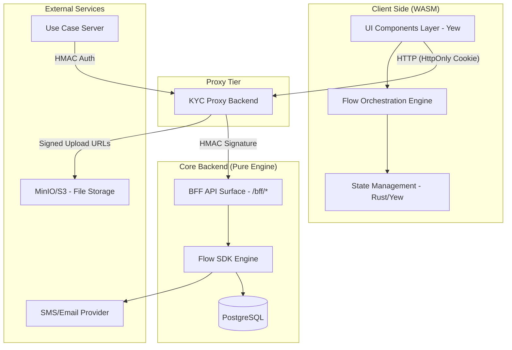
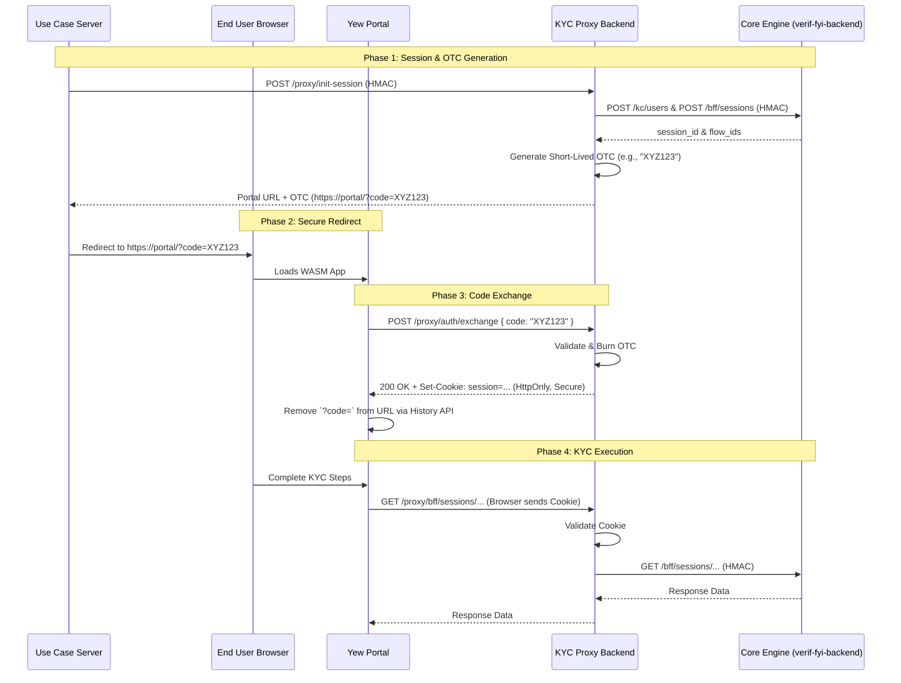

# KYC Hosted Page Portal Architecture

## Why?

The KYC Hosted Page Portal provides a user-facing, high-conversion experience for end-users to complete their identity verification (KYC) flows. It must handle complex, state-driven processes (like document uploads and OTP) while remaining extremely secure. It cannot store sensitive access tokens in local storage or expose them in URLs.

## Actual

The portal is a decoupled Single Page Application (SPA) built with **Rust Yew (WASM)**. Under the new architecture, it communicates exclusively with the **KYC Proxy Backend**. The Proxy handles the secure exchange of One-Time Codes (OTCs) for `HttpOnly` session cookies, completely hiding the underlying HMAC-authenticated Core Engine (`verif-fyi-backend`) from the public internet.

## Constraints

- **WASM environment**: Must handle network requests smoothly and rely on browser-managed cookies for authentication.
- **Security**: Strict zero-trust approach on the client side. No JWTs or access tokens in `localStorage` or `sessionStorage`. No sensitive tokens lingering in the browser's URL bar.
- **Network Strategy**: The core engine is walled off. All portal traffic goes through the Proxy Backend.

## Findings

By delegating authentication to the Proxy Backend using a One-Time Code exchange to a secure cookie, the Yew portal becomes significantly simpler and safer. It no longer needs to parse, store, or attach JWTs manually; the browser handles the `HttpOnly` cookie automatically on all requests to `/proxy/bff/*`.

## Architecture Diagram

### High-Level Component Architecture

### Flow Initiation & Authentication Sequence (One-Time Code)

## How to?

### Technology Stack

| Category             | Recommendation                    | Justification                                                                 |
| -------------------- | --------------------------------- | ----------------------------------------------------------------------------- |
| **Framework**        | **Rust Yew**                      | WASM-based SPA for high performance and memory safety.                        |
| **State Management** | **Rust-based state pattern**      | Leveraging Yew's architecture for predictable state transitions.              |
| **Authentication**   | **Browser Cookies**               | Relies entirely on `HttpOnly`, `SameSite=Strict` cookies issued by the Proxy. |
| **UI Library**       | **Yew Components + Tailwind CSS** | High customization and performance.                                           |

### Authentication Implementation (Client-Side)

1. **Extraction**: On startup, Yew checks the URL for a `?code=` query parameter.
2. **Exchange**: If present, make an immediate `POST` to the Proxy to exchange it for a cookie.
3. **Cleanup**: Use `web_sys::window().unwrap().history().unwrap().replace_state(...)` to strip the `?code=` from the URL, preventing accidental sharing or logging.
4. **Operation**: Configure the HTTP client (e.g., `reqwasm` or `gloo-net`) to `include` credentials so the browser automatically sends the secure cookie on subsequent requests to `/proxy/bff/*`.

### File Upload Strategy

1. **Capture**: Use browser APIs via Yew to capture document files.
2. **Upload**: Send files to the Proxy endpoint `/proxy/bff_uploads` (which streams it to S3, or returns a pre-signed S3 URL for direct upload).
3. **Submit**: Include the resulting object key in subsequent state transitions.

## Conclusion

This proxy-based architecture drastically improves the security posture of the hosted KYC page. By utilizing a One-Time Code exchange and relying on `HttpOnly` cookies, we completely eliminate the risks associated with managing raw access tokens in the browser's memory, local storage, or visible URLs.
